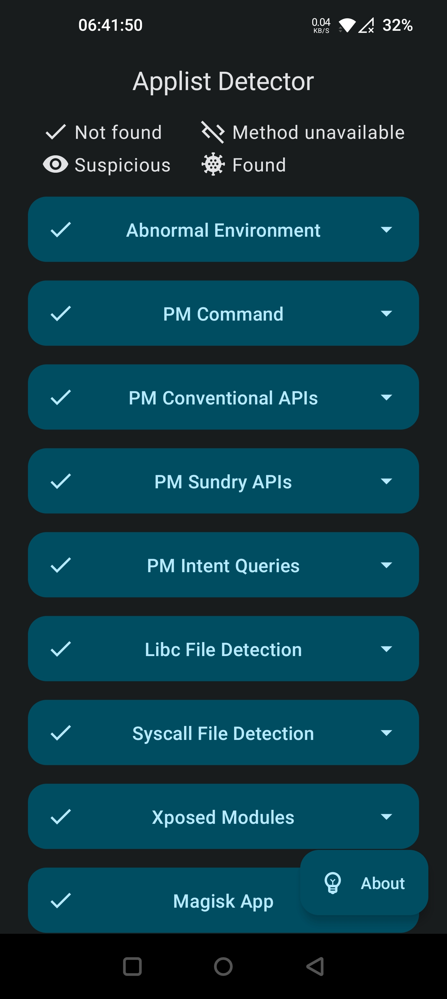
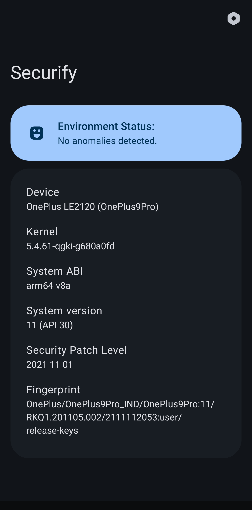
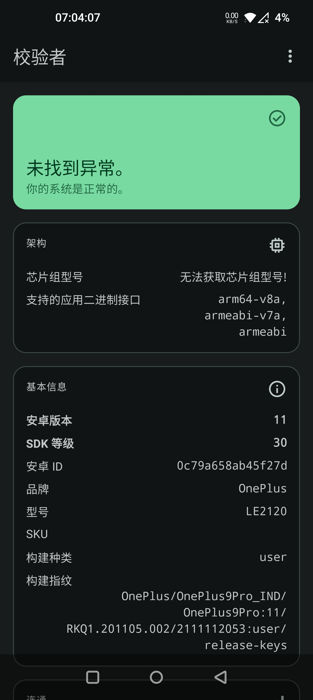
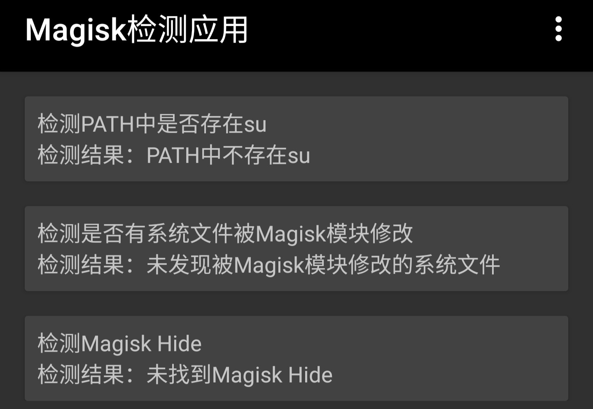

## Detectors

### Android Integrity Checker
- **Package Name**: ``com.thend.integritychecker``
- **Official Link**: [https://play.google.com/store/apps/details?id=com.thend.integritychecker](https://play.google.com/store/apps/details?id=com.thend.integritychecker)
- **Source Status**: Unknown
- **Developing Purpose**: Play Integrity Check
- **Latest Version**: ``v1.0.4 (1000004)``
- **Release Date**: November 14th, 2023

### APTest

- **Package Name**: ``me.garfieldhan.hiapatch``
- **Official Link**: Unknown
- **Source Status**: Unknown
- **Developing Purpose**: Apatch Detection
- **Latest Version**: ``v1.0``
- **Release Date**: Before December 27th, 2024

### Applist Detector

- **Package Name**: ``icu.nullptr.applistdetector`` and ``com.tsng.applistdetector``
- **Official Link**: [https://github.com/Dr-TSNG/ApplistDetector](https://github.com/Dr-TSNG/ApplistDetector)
- **Source Status**: Open-source
- **Developing Purpose**: Applist Detection
- **Latest Version**: ``v2.4``
- **Release Date**: August 12th, 2022
- **Detection Remark**: The package name ``com.tsng.applistdetector`` is a history name (about ``v.1.3.2``)

### Checker

- **Package Name**: ``org.akanework.checker``
- **Official Link**: Unknown
- **Source Status**: Unknown
- **Developing Purpose**: Environment Detection
- **Latest Version**: ``v1.0.9``
- **Release Date**: Before January 8th, 2025

### DRM Info

- **Package Name**: ``com.androidfung.drminfo``
- **Official Link**: [https://play.google.com/store/apps/details?id=com.androidfung.drminfo](https://play.google.com/store/apps/details?id=com.androidfung.drminfo)
- **Source Status**: Unknown
- **Developing Purpose**: Information Gathering
- **Latest Version**: ``v1.1.15-240919``
- **Release Date**: September 19th, 2024
- **Detection Remark**: Check whether the Security Level is Level 1

### Holmes

- **Package Name**: ``me.garfieldhan.holmes``
- **Official Link**: [https://t.me/app_process64](https://t.me/app_process64)
- **Source Status**: Unknown
- **Developing Purpose**: Environment Detection
- **Latest Version**: ``v1.5.1``
- **Release Date**: Before December 26th, 2024
- **Detection Remark**: Fail passing if the application crashes

### Hunter

- **Package Name**: ``com.zhenxi.hunter``
- **Official Link**: Unknown
- **Source Status**: Unknown
- **Developing Purpose**: Environment Detection
- **Latest Version**: ``v6.0.7``
- **Release Date**: January 14th, 2025

### IIQE

- **Package Name**: ``com.prudential.iiqe``
- **Official Link**: [https://iiqe-cms.prudential.com.hk/iiqe/](https://iiqe-cms.prudential.com.hk/iiqe/)
- **Source Status**: Android Desktop Application
- **Developing Purpose**: Not Developed Only For Environment Detection
- **Latest Version**: ``v6.4.1``
- **Release Date**: June 20th, 2024. 

### Key Attestation

- **Package Name**: ``io.github.vvb2060.keyattestation``
- **Official Link**: [https://github.com/vvb2060/KeyAttestation](https://github.com/vvb2060/KeyAttestation)
- **Source Status**: Open-source
- **Developing Purpose**: Key Attestation
- **Latest Version**: ``v1.7.0``
- **Release Date**: After November 16th, 2023
- **Detection Remark**: The ``v1.7.0`` version is not released on the official link while the ``v1.6.0`` version is the latest one on the official link

### Magisk Detector

- **Package Name**: ``io.github.vvb2060.magiskdetector``
- **Official Link**: [https://github.com/vvb2060/MagiskDetector](https://github.com/vvb2060/MagiskDetector)
- **Source Status**: Archieved Open-source
- **Developing Purpose**: Magisk Detection
- **Latest Version**: ``v3.0``
- **Release Date**: Auguest 9th, 2022

### Momo

- **Package Name**: ``io.github.vvb2060.mahoshojo``
- **Official Link**: Unknown
- **Source Status**: Unknown
- **Developing Purpose**: Environment Detection
- **Latest Version**: ``v4.4.1``
- **Release Date**: Before January 7th, 2023
- **Detection Remark**: Please do not spoof this detector happily to get a happy face since spoofing detectors cannot essentially solve the environment

### Money2India

- **Package Name**: ``com.icicibank.m2i``
- **Official Link**: [https://play.google.com/store/apps/details?id=com.icicibank.m2i](https://play.google.com/store/apps/details?id=com.icicibank.m2i)
- **Source Status**: Android Desktop Application
- **Developing Purpose**: Not Developed Only For Environment Detection
- **Latest Version**: ``v1.0.73``
- **Release Date**: December 22nd, 2024

### NSDL Jiffy

- **Package Name**: Unknown
- **Official Link**: [https://play.google.com/store/apps/details?id=com.nsdlpb.jiffy](https://play.google.com/store/apps/details?id=com.nsdlpb.jiffy)
- **Source Status**: Android Desktop Application
- **Developing Purpose**: Not Developed Only For Environment Detection
- **Latest Version**: ``Unknown``
- **Release Date**: December 5th, 2024
- **Detection Remark**: The most challenging one

### Native Root Detector / Native Detector / Native Check

- **Package Name**: ``com.reveny.nativecheck``
- **Official Link**: [https://github.com/reveny/Android-Native-Root-Detector](https://github.com/reveny/Android-Native-Root-Detector) and [https://t.me/rootdetector](https://t.me/rootdetector)
- **Source Status**: Open-source
- **Developing Purpose**: Environment Detection
- **Latest Version**: ``v6.6.0``
- **Release Date**: January 11th, 2025

### Native Test

- **Package Name**: ``icu.nullptr.nativetest``
- **Official Link**: Unknown
- **Source Status**: Closed-source
- **Developing Purpose**: Environment Detection
- **Latest Version**: ``v30``
- **Release Date**: November 15th, 2024

### Play Integrity API Checker

- **Package Name**: ``gr.nikolasspyr.integritycheck``
- **Official Link**: [https://github.com/1nikolas/play-integrity-checker-app](https://github.com/1nikolas/play-integrity-checker-app) and [https://play.google.com/store/apps/details?id=gr.nikolasspyr.integritycheck](https://play.google.com/store/apps/details?id=gr.nikolasspyr.integritycheck)
- **Source Status**: Open-source
- **Developing Purpose**: Play Integrity Check
- **Latest Version**: ``v1.2``
- **Release Date**: December 3rd, 2023

### Postal Savings Bank of China / PSBC

- **Package Name**: ``com.yitong.mbank.psbc``
- **Official Link**: [https://phone.psbc.com](https://phone.psbc.com)
- **Source Status**: Android Desktop Application
- **Developing Purpose**: Not Developed Only For Environment Detection
- **Latest Version**: ``v10.0.1``
- **Release Date**: December 28th, 2024

### Ruru

- **Package Name**: ``com.byxiaorun.detector``
- **Official Link**: [https://github.com/byxiaorun/Ruru](https://github.com/byxiaorun/Ruru)
- **Source Status**: Open-source
- **Developing Purpose**: Environment Detection
- **Latest Version**: ``v1.1.1 (15)``
- **Release Date**: April 18th, 2024

### Securify

- **Package Name**: ``io.github.rabehx.securify``
- **Official Link**: [https://github.com/RabehX/Securify](https://github.com/RabehX/Securify)
- **Source Status**: Closed-source
- **Developing Purpose**: Environment Detection
- **Latest Version**: ``v1.3.0``
- **Release Date**: July 28th, 2024

### Simple Play Integrity Checker / SPIC

- **Package Name**: ``com.henrikherzig.playintegritychecker``
- **Official Link**: Unknown
- **Source Status**: Unknown
- **Developing Purpose**: Play Integrity Check
- **Latest Version**: ``v1.4.0``
- **Release Date**: Before November 10th, 2024

### Xposed Checker

- **Package Name**: ``ml.w568w.checkxposed``
- **Official Link**: [https://github.com/w568w/XposedChecker](https://github.com/w568w/XposedChecker)
- **Source Status**: Open-source
- **Developing Purpose**: Environment Detection
- **Latest Version**: ``v7.1 (9)``
- **Release Date**: Before February 3rd, 2022

### Xposed Detector

- **Package Name**: ``io.github.vvb2060.xposeddetector``
- **Official Link**: [https://github.com/vvb2060/XposedDetector](https://github.com/vvb2060/XposedDetector)
- **Source Status**: Archieved Open-source
- **Developing Purpose**: Environment Detection
- **Latest Version**: ``v2.2 (5)``
- **Latest Version**: March 27th, 2021

### Yet Another SafetyNet Attestation Checker / YASNAC

- **Package Name**: ``rikka.safetynetchecker``
- **Official Link**: [https://github.com/RikkaW/YASNAC](https://github.com/RikkaW/YASNAC)
- **Source Status**: Archieved Open-source
- **Developing Purpose**: Play Integrity Check
- **Latest Version**: ``v1.1.5.r65.15110ef310 (65)``
- **Release Date**: April 4th, 2022

---

## 检测工具

### Android Integrity Checker
- **应用包名**：``com.thend.integritychecker``
- **官方链接**：[https://play.google.com/store/apps/details?id=com.thend.integritychecker](https://play.google.com/store/apps/details?id=com.thend.integritychecker)
- **开源状态**：未知
- **开发用途**：Play 完整性检验
- **最新版本**：``v1.0.4 (1000004)``
- **发布日期**：2023 年 11 月 14 日

### APTest

- **应用包名**：``me.garfieldhan.hiapatch``
- **官方链接**：未知
- **开源状态**：未知
- **开发用途**：Apatch 环境检测
- **最新版本**：``v1.0``
- **发布日期**：2024 年 12 月 27 日前

### Applist Detector / 应用列表检测器

- **应用包名**：``icu.nullptr.applistdetector`` 和 ``com.tsng.applistdetector``
- **官方链接**：[https://github.com/Dr-TSNG/ApplistDetector](https://github.com/Dr-TSNG/ApplistDetector)
- **开源状态**：开源
- **开发用途**：应用列表检测
- **最新版本**：``v2.4``
- **发布日期**：2022 年 8 月 12 日
- **注意事项**：包名 ``com.tsng.applistdetector`` 是历史版本包名（约 ``v1.3.2``）

### Checker / 校验者

- **应用包名**：``org.akanework.checker``
- **官方链接**：未知
- **开源状态**：未知
- **开发用途**：环境检测
- **最新版本**：``v1.0.9``
- **发布日期**：2025 年 1 月 8 日前

### DRM Info

- **应用包名**：``com.androidfung.drminfo``
- **官方链接**：[https://play.google.com/store/apps/details?id=com.androidfung.drminfo](https://play.google.com/store/apps/details?id=com.androidfung.drminfo)
- **开源状态**：未知
- **开发用途**：信息搜集
- **最新版本**：``v1.1.15-240919``
- **发布日期**：2024 年 9 月 19 日
- **注意事项**：Security Level 应当显示为 Level 1

### Holmes

- **应用包名**：``me.garfieldhan.holmes``
- **官方链接**：[https://t.me/app_process64](https://t.me/app_process64)
- **开源状态**：未知
- **开发用途**：环境检测
- **最新版本**：``v1.5.1``
- **发布日期**：2024 年 12 月 26 日前
- **注意事项**：闪退或许也是过检失败

### Hunter

- **应用包名**：``com.zhenxi.hunter``
- **官方链接**：未知
- **开源状态**：未知
- **开发用途**：环境检测
- **最新版本**：``v6.0.7``
- **发布日期**：2025 年 1 月 14 日

### IIQE / IIQE 一考通

- **应用包名**：``com.prudential.iiqe``
- **官方链接**：[https://iiqe-cms.prudential.com.hk/iiqe/](https://iiqe-cms.prudential.com.hk/iiqe/)
- **开源状态**：安卓桌面应用
- **开发用途**：并非专为检测环境开发
- **最新版本**：``v6.4.1``
- **发布日期**：2024 年 6 月 20 日

### Key Attestation / 密钥认证

- **应用包名**：``io.github.vvb2060.keyattestation``
- **官方链接**：[https://github.com/vvb2060/KeyAttestation](https://github.com/vvb2060/KeyAttestation)
- **开源状态**：开源
- **开发用途**：密钥认证
- **最新版本**：``v1.7.0``
- **发布日期**：2023 年 11 月 16 日后
- **注意事项**：版本 ``v1.7.0`` 不是从官方链接发布而官方链接的最新版本为 ``v1.6.0``

### Magisk Detector / Magisk 检测应用

- **应用包名**：``io.github.vvb2060.magiskdetector``
- **官方链接**：[https://github.com/vvb2060/MagiskDetector](https://github.com/vvb2060/MagiskDetector)
- **开源状态**：开源但已存档
- **开发用途**：面具环境检测
- **最新版本**：``v3.0``
- **发布日期**：2022 年 8 月 9 日

### Momo

- **应用包名**：``io.github.vvb2060.mahoshojo``
- **官方链接**：未知
- **开源状态**：未知
- **开发用途**：环境检测
- **最新版本**：``v4.4.1``
- **发布日期**：2023 年 1 月 7 日前
- **注意事项**：请不要为了得到一张快乐的脸而高兴地欺骗这个探测器，因为欺骗探测器不能从根本上解决环境问题

### Money2India

- **应用包名**：``com.icicibank.m2i``
- **官方链接**：[https://play.google.com/store/apps/details?id=com.icicibank.m2i](https://play.google.com/store/apps/details?id=com.icicibank.m2i)
- **开源状态**：安卓桌面应用
- **开发用途**：并非专为检测环境开发
- **最新版本**：``v1.0.73``
- **发布日期**：2024 年 12 月 22 日

### NSDL Jiffy

- **应用包名**：未知
- **官方链接**：[https://play.google.com/store/apps/details?id=com.nsdlpb.jiffy](https://play.google.com/store/apps/details?id=com.nsdlpb.jiffy)
- **开源状态**：安卓桌面应用
- **开发用途**：并非专为检测环境开发
- **最新版本**：``未知``
- **发布日期**：2024 年 12 月 5 日
- **注意事项**：应该是最“难过”的

### Native Root Detector / Native Detector / Native Check

- **应用包名**：``com.reveny.nativecheck``
- **官方链接**：[https://github.com/reveny/Android-Native-Root-Detector](https://github.com/reveny/Android-Native-Root-Detector) 和 [https://t.me/rootdetector](https://t.me/rootdetector)
- **开源状态**：开源
- **开发用途**：环境检测
- **最新版本**：``v6.6.0``
- **发布日期**：2025 年 1 月 11 日

### Native Test / 牛头人

- **应用包名**：``icu.nullptr.nativetest``
- **官方链接**：未知
- **开源状态**：闭源
- **开发用途**：环境检测
- **最新版本**：``v30``
- **发布日期**：2024 年 11 月 15 日

### Play Integrity API Checker

- **应用包名**：``gr.nikolasspyr.integritycheck``
- **官方链接**：[https://github.com/1nikolas/play-integrity-checker-app](https://github.com/1nikolas/play-integrity-checker-app) 和 [https://play.google.com/store/apps/details?id=gr.nikolasspyr.integritycheck](https://play.google.com/store/apps/details?id=gr.nikolasspyr.integritycheck)
- **开源状态**：开源
- **开发用途**：Play 完整性检验
- **最新版本**：``v1.2``
- **发布日期**：2023 年 12 月 3 日

### Postal Savings Bank of China / PSBC / 邮储银行

- **应用包名**：``com.yitong.mbank.psbc``
- **官方链接**：[https://phone.psbc.com](https://phone.psbc.com)
- **开源状态**：安卓桌面应用
- **开发用途**：并非专为检测环境开发
- **最新版本**：``v10.0.1``
- **发布日期**：2024 年 12 月 28 日

### Ruru

- **应用包名**：``com.byxiaorun.detector``
- **官方链接**：[https://github.com/byxiaorun/Ruru](https://github.com/byxiaorun/Ruru)
- **开源状态**：开源
- **开发用途**：环境检测
- **最新版本**：``v1.1.1(15)``
- **发布日期**：2024 年 4 月 18 日

### Securify

- **应用包名**：``io.github.rabehx.securify``
- **官方链接**：[https://github.com/RabehX/Securify](https://github.com/RabehX/Securify)
- **开源状态**：闭源
- **开发用途**：环境检测
- **最新版本**：``v1.3.0``
- **发布日期**：2024 年 7 月 28 日

### Simple Play Integrity Checker / SPIC

- **应用包名**：``com.henrikherzig.playintegritychecker``
- **官方链接**：未知
- **开源状态**：未知
- **开发用途**：Play 完整性检验
- **最新版本**：``v1.4.0``
- **发布日期**：2024 年 11 月 10 日前

### Xposed Checker

- **应用包名**：``ml.w568w.checkxposed``
- **官方链接**：[https://github.com/w568w/XposedChecker](https://github.com/w568w/XposedChecker)
- **开源状态**：开源
- **开发用途**：环境检测
- **最新版本**：``v7.1 (9)``
- **发布日期**：2022 年 2 月 3 日前

### Xposed Detector / Xposed 检测应用

- **应用包名**：``io.github.vvb2060.xposeddetector``
- **官方链接**：[https://github.com/vvb2060/XposedDetector](https://github.com/vvb2060/XposedDetector)
- **开源状态**：开源但已存档
- **开发用途**：环境检测
- **最新版本**：``v2.2``
- **发布日期**：2021 年 3 月 27 日

### Yet Another SafetyNet Attestation Checker / YASNAC

- **应用包名**：``rikka.safetynetchecker``
- **官方链接**：[https://github.com/RikkaW/YASNAC](https://github.com/RikkaW/YASNAC)
- **开源状态**：开源但已存档
- **开发用途**：Play 完整性检验
- **最新版本**：``v1.1.5.r65.15110ef310 (65)``
- **发布日期**：April 4th, 2022
