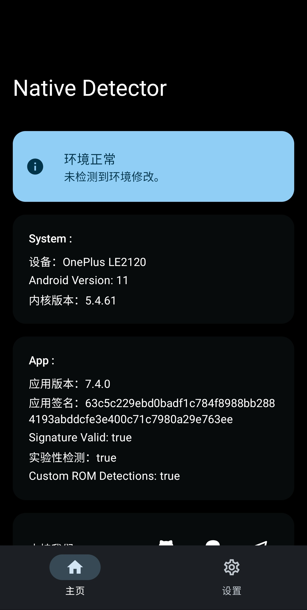

## Detectors

### Android Integrity Checker

- **Package Name**: ``com.thend.integritychecker``
- **Official Link**: https://play.google.com/store/apps/details?id=com.thend.integritychecker
- **Developing Purpose**: Play Integrity Check
- **Latest Version**: ``v1.0.4 (1000004)``
- **Release Date**:  November 14th, 2023

### APTest

- **Package Name**: ``me.garfieldhan.hiapatch``
- **Developing Purpose**: Apatch Detection
- **Latest Version**: ``v1.0``
- **Release Date**: Before December 27th, 2024

### Applist Detector

- **Package Names**: ``icu.nullptr.applistdetector``; ``com.tsng.applistdetector``
- **Official Link**: https://github.com/Dr-TSNG/ApplistDetector
- **Source Status**: Open-source
- **Developing Purpose**: Applist Detection
- **Latest Version**: ``v2.4``
- **Release Date**:  August 12th, 2022
- **Detection Remark**: The package name ``com.tsng.applistdetector`` is a history name (about ``v1.3.2``). 
- 

### Bank of China (Hong Kong)

- **Package Name**: ``com.bochk.app.aos``
- **Official Link**: https://play.google.com/store/apps/details?id=com.bochk.app.aos
- **Source Status**: Android Desktop Application
- **Developing Purpose**: Android Desktop Application
- **Latest Version**: ``7.2.9 (141)``
- **Release Date**:  April 9th, 2025

### Checker

- **Package Name**: ``org.akanework.checker``
- **Developing Purpose**: Environment Detection
- **Latest Version**: ``v1.0.9``
- **Release Date**: Before January 8th, 2025

### DRM Info

- **Package Name**: ``com.androidfung.drminfo``
- **Official Link**: https://play.google.com/store/apps/details?id=com.androidfung.drminfo
- **Developing Purpose**: Information Gathering
- **Latest Version**: ``v1.1.15-240919``
- **Release Date**:  September 19th, 2024
- **Detection Remark**: Please check whether the Security Level is Level 1. The smaller the level, the better the device is. 

### Hunter

- **Package Name**: ``com.zhenxi.hunter``
- **Developing Purpose**: Environment Detection
- **Latest Version**: ``v6.18 (618)``
- **Release Date**:  April 23rd, 2025
- **Detection Remark**: Please wait about 10 seconds to complete the detection and display. 

### IIQE 一考通

- **Alias**: IIQE Yikaotong
- **Package Name**: ``com.prudential.iiqe``
- **Official Link**: https://iiqe-cms.prudential.com.hk/iiqe/
- **Source Status**: Android Desktop Application
- **Developing Purpose**: Android Desktop Application
- **Latest Version**: ``v6.4.3C88``
- **Release Date**:  March 3rd, 2025

### Luna

- **Package Name**: ``luna.safe.luna``
- **Official Link**: https://www.54nb.com/lunathanks.html
- **Source Status**: Android Desktop Application
- **Developing Purpose**: Android Desktop Application
- **Latest Version**: ``v1.4.0.5 (1405)``
- **Release Date**:  April 28th, 2025

### Key Attestation

- **Package Name**: ``io.github.vvb2060.keyattestation``
- **Official Links**: [https://github.com/vvb2060/KeyAttestation](https://github.com/vvb2060/KeyAttestation); [https://t.me/magiskalpha](https://t.me/magiskalpha); [https://t.me/playintegrityfix](https://t.me/playintegrityfix); [https://github.com/chiteroman/KeyAttestation](https://github.com/chiteroman/KeyAttestation)
- **Source Status**: Open-source
- **Developing Purpose**: Key Attestation
- **Latest Version**: ``v1.8.4``
- **Release Date**:  February 6th, 2025

### Magisk Detector

- **Package Name**: ``io.github.vvb2060.magiskdetector``
- **Official Link**: https://github.com/vvb2060/MagiskDetector
- **Source Status**: Archieved & Open-source
- **Developing Purpose**: Magisk Detection
- **Latest Version**: ``v3.0``
- **Release Date**:  August 9th, 2022

### Momo

- **Package Name**: ``io.github.vvb2060.mahoshojo``
- **Developing Purpose**: Environment Detection
- **Latest Version**: ``v4.4.1``
- **Release Date**: Before January 7th, 2023
- **Detection Remark**: Please do not spoof this detector to get a happy face since spoofing detectors cannot essentially solve the environment issues. 

### Money2India

- **Package Name**: ``com.icicibank.m2i``
- **Official Link**: https://play.google.com/store/apps/details?id=com.icicibank.m2i
- **Source Status**: Android Desktop Application
- **Developing Purpose**: Android Desktop Application
- **Latest Version**: ``v1.0.73``
- **Release Date**:  December 22nd, 2024

### NSDL Jiffy

- **Package Name**: ``com.nsdlpb.jiffy``
- **Official Link**: https://play.google.com/store/apps/details?id=com.nsdlpb.jiffy
- **Source Status**: Android Desktop Application
- **Developing Purpose**: Android Desktop Application
- **Latest Version**: ``v3.0.7``
- **Release Date**:  April 21st, 2025
- **Detection Remark**: This can be the most challenging one among all the detectors. 

### Native Root Detector

- **Alias**: Native Detector; Native Check
- **Package Name**: ``com.reveny.nativecheck``
- **Official Links**: [https://github.com/reveny/Android-Native-Root-Detector](https://github.com/reveny/Android-Native-Root-Detector); [https://t.me/rootdetector](https://t.me/rootdetector)
- **Source Status**: Open-source
- **Developing Purpose**: Environment Detection
- **Latest Version**: ``v6.8.0 (680)``
- **Release Date**:  March 24th, 2025
- **Detection Remark**: For the first time, please go to the settings page to enable experimental detection and telemetry. Subsequently, re-launch the detector to show proper detection results. After changing environments or updating this detector, please be sure to completely uninstall the installed version before installing the detector to avoid the previous ``.odex`` affecting the detection results. 

### Native Test

- **Alias**: Holmes
- **Package Names**: ``me.garfieldhan.holmes``; ``icu.nullptr.nativetest``; ``com.android.nativetest``
- **Official Link**: https://t.me/app_process64
- **Source Status**: Closed-source & For Sale
- **Developing Purpose**: Environment Detection
- **Latest Version**: ``v30 (Pure Minotaur)``
- **Release Date**:  April 18th, 2024
- **Detection Remark**: Holmes and Native Test are integrated here. Some historical versions will crash on some devices (older versions of Holmes), report false positives (Native Test from ``v26`` to the initial ``v30`` versions may mis-report Malicious Hook), and require network access (recent versions of Holmes). 

### Octopus

- **Package Name**: ``com.octopuscards.nfc_reader``
- **Official Link**: https://play.google.com/store/apps/details?id=com.octopuscards.nfc_reader
- **Source Status**: Android Desktop Application
- **Developing Purpose**: Android Desktop Application
- **Latest Version**: ``v12.16.1 (3181)``
- **Release Date**:  April 23rd, 2024

### Play Integrity API Checker

- **Package Name**: ``gr.nikolasspyr.integritycheck``
- **Official Links**: [https://github.com/1nikolas/play-integrity-checker-app](https://github.com/1nikolas/play-integrity-checker-app); [https://play.google.com/store/apps/details?id=gr.nikolasspyr.integritycheck](https://play.google.com/store/apps/details?id=gr.nikolasspyr.integritycheck)
- **Source Status**: Open-source
- **Developing Purpose**: Play Integrity Check
- **Latest Version**: ``v1.2``
- **Release Date**:  December 3rd, 2023

### Revolut

- **Package Name**: ``com.revolut.revolut``
- **Official Link**: https://play.google.com/store/apps/details?id=com.revolut.revolut
- **Source Status**: Android Desktop Application
- **Developing Purpose**: Android Desktop Application
- **Latest Version**: ``v10.76.1 (1007605497)``
- **Release Date**:  April 22nd, 2024

### Ruru

- **Package Name**: ``com.byxiaorun.detector``
- **Official Link**: https://github.com/byxiaorun/Ruru
- **Source Status**: Open-source
- **Developing Purpose**: Environment Detection
- **Latest Version**: ``v1.1.1 (15)``
- **Release Date**:  April 18th, 2024

### Securify

- **Package Name**: ``io.github.rabehx.securify``
- **Official Link**: https://github.com/RabehX/Securify
- **Source Status**: Closed-source
- **Developing Purpose**: Environment Detection
- **Latest Version**: ``v1.3.0``
- **Release Date**:  July 28th, 2024
- 

### Simple Play Integrity Checker

- **Alias**: SPIC
- **Package Name**: ``com.henrikherzig.playintegritychecker``
- **Developing Purpose**: Play Integrity Check
- **Latest Version**: ``v1.4.0``
- **Release Date**: Before November 10th, 2024

### Uber Driver

- **Package Name**: ``com.ubercab.driver``
- **Official Link**: https://play.google.com/store/apps/details?id=com.ubercab.driver
- **Source Status**: Android Desktop Application
- **Developing Purpose**: Android Desktop Application
- **Latest Version**: ``v4.522.10000 (224025)``
- **Release Date**:  April 14th, 2025

### Xposed Checker

- **Package Name**: ``ml.w568w.checkxposed``
- **Official Link**: https://github.com/w568w/XposedChecker
- **Source Status**: Open-source
- **Developing Purpose**: Environment Detection
- **Latest Version**: ``v7.1 (9)``
- **Release Date**: Before February 3rd, 2022

### Xposed Detector

- **Package Name**: ``io.github.vvb2060.xposeddetector``
- **Official Link**: https://github.com/vvb2060/XposedDetector
- **Source Status**: Archieved & Open-source
- **Developing Purpose**: Environment Detection
- **Latest Version**: ``v2.2 (5)``
- **Release Date**:  March 27th, 2021

### Yet Another SafetyNet Attestation Checker

- **Alias**: YASNAC
- **Package Name**: ``rikka.safetynetchecker``
- **Official Link**: https://github.com/RikkaW/YASNAC
- **Source Status**: Archieved & Open-source
- **Developing Purpose**: Play Integrity Check
- **Latest Version**: ``v1.1.5.r65.15110ef310 (65)``
- **Release Date**:  April 4th, 2022

### 邮储银行

- **Alias**: Postal Savings Bank of China; PSBC
- **Package Name**: ``com.yitong.mbank.psbc``
- **Official Link**: https://phone.psbc.com
- **Source Status**: Android Desktop Application
- **Developing Purpose**: Android Desktop Application
- **Latest Version**: ``v10.2.0``
- **Release Date**:  March 3rd, 2025

---

## 检测软件

### Android Integrity Checker

- **应用包名**：``com.thend.integritychecker``
- **官方链接**：[https://play.google.com/store/apps/details?id=com.thend.integritychecker](https://play.google.com/store/apps/details?id=com.thend.integritychecker)
- **开发用途**：Play 完整性检测
- **最新版本**：``v1.0.4 (1000004)``
- **发行日期**： 2023 年 11 月 14 日

### APTest

- **应用包名**：``me.garfieldhan.hiapatch``
- **开发用途**：Apatch 检测
- **最新版本**：``v1.0``
- **发行日期**：早于 2024 年 12 月 27 日

### Applist Detector

- **应用别称**：应用列表检测; 检测应用列表
- **应用包名**：``icu.nullptr.applistdetector``；``com.tsng.applistdetector``
- **官方链接**：[https://github.com/Dr-TSNG/ApplistDetector](https://github.com/Dr-TSNG/ApplistDetector)
- **开源状态**：开源
- **开发用途**：应用列表检测
- **最新版本**：``v2.4``
- **发行日期**： 2022 年 8 月 12 日
- **检测备注**：包名 ``com.tsng.applistdetector`` 是历史版本包名（约 ``v1.3.2``）。
- 

### Bank of China (Hong Kong)

- **应用别称**：BOCHK中银香港; 中国银行（香港）; 中银香港
- **应用包名**：``com.bochk.app.aos``
- **官方链接**：[https://play.google.com/store/apps/details?id=com.bochk.app.aos](https://play.google.com/store/apps/details?id=com.bochk.app.aos)
- **开源状态**：安卓桌面应用
- **开发用途**：安卓桌面应用
- **最新版本**：``7.2.9 (141)``
- **发行日期**： 2025 年 4 月 9 日

### Checker

- **应用别称**：校验者
- **应用包名**：``org.akanework.checker``
- **开发用途**：环境检测
- **最新版本**：``v1.0.9``
- **发行日期**：早于 2025 年 1 月 8 日
- 

### DRM Info

- **应用包名**：``com.androidfung.drminfo``
- **官方链接**：[https://play.google.com/store/apps/details?id=com.androidfung.drminfo](https://play.google.com/store/apps/details?id=com.androidfung.drminfo)
- **开发用途**：信息收集
- **最新版本**：``v1.1.15-240919``
- **发行日期**： 2024 年 9 月 19 日
- **检测备注**：请检查 Security Level 是否为 L1，等级数值越小越好。

### Hunter

- **应用包名**：``com.zhenxi.hunter``
- **开发用途**：环境检测
- **最新版本**：``v6.18 (618)``
- **发行日期**： 2025 年 4 月 23 日
- **检测备注**：请等待 10 秒左右以完成检测和显示。
- 

### IIQE 一考通

- **应用包名**：``com.prudential.iiqe``
- **官方链接**：[https://iiqe-cms.prudential.com.hk/iiqe/](https://iiqe-cms.prudential.com.hk/iiqe/)
- **开源状态**：安卓桌面应用
- **开发用途**：安卓桌面应用
- **最新版本**：``v6.4.3C88``
- **发行日期**： 2025 年 3 月 3 日

### Luna

- **应用包名**：``luna.safe.luna``
- **官方链接**：[https://www.54nb.com/lunathanks.html](https://www.54nb.com/lunathanks.html)
- **开源状态**：安卓桌面应用
- **开发用途**：安卓桌面应用
- **最新版本**：``v1.4.0.5 (1405)``
- **发行日期**： 2025 年 4 月 28 日

### Key Attestation

- **应用别称**：密钥认证
- **应用包名**：``io.github.vvb2060.keyattestation``
- **官方链接**：[https://github.com/vvb2060/KeyAttestation](https://github.com/vvb2060/KeyAttestation)；[https://t.me/magiskalpha](https://t.me/magiskalpha)；[https://t.me/playintegrityfix](https://t.me/playintegrityfix)；[https://github.com/chiteroman/KeyAttestation](https://github.com/chiteroman/KeyAttestation)
- **开源状态**：开源
- **开发用途**：密钥认证
- **最新版本**：``v1.8.4``
- **发行日期**： 2025 年 2 月 6 日
- 

### Magisk Detector

- **应用别称**：Magisk 检测应用
- **应用包名**：``io.github.vvb2060.magiskdetector``
- **官方链接**：[https://github.com/vvb2060/MagiskDetector](https://github.com/vvb2060/MagiskDetector)
- **开源状态**：已存档 & 开源
- **开发用途**：面具检测
- **最新版本**：``v3.0``
- **发行日期**： 2022 年 8 月 9 日
- 

### Momo

- **应用别称**：陌陌
- **应用包名**：``io.github.vvb2060.mahoshojo``
- **开发用途**：环境检测
- **最新版本**：``v4.4.1``
- **发行日期**：早于 2023 年 1 月 7 日
- **检测备注**：请不要为了得到一张笑脸而欺骗该检测软件，因为欺骗某一个检测软件并不能从本质上解决环境问题。
- 

### Money2India

- **应用包名**：``com.icicibank.m2i``
- **官方链接**：[https://play.google.com/store/apps/details?id=com.icicibank.m2i](https://play.google.com/store/apps/details?id=com.icicibank.m2i)
- **开源状态**：安卓桌面应用
- **开发用途**：安卓桌面应用
- **最新版本**：``v1.0.73``
- **发行日期**： 2024 年 12 月 22 日

### NSDL Jiffy

- **应用包名**：``com.nsdlpb.jiffy``
- **官方链接**：[https://play.google.com/store/apps/details?id=com.nsdlpb.jiffy](https://play.google.com/store/apps/details?id=com.nsdlpb.jiffy)
- **开源状态**：安卓桌面应用
- **开发用途**：安卓桌面应用
- **最新版本**：``v3.0.7``
- **发行日期**： 2025 年 4 月 21 日
- **检测备注**：这应该是目前最难以绕过的检测。

### Native Root Detector

- **应用别称**：Native Detector; Native Check
- **应用包名**：``com.reveny.nativecheck``
- **官方链接**：[https://github.com/reveny/Android-Native-Root-Detector](https://github.com/reveny/Android-Native-Root-Detector)；[https://t.me/rootdetector](https://t.me/rootdetector)
- **开源状态**：开源
- **开发用途**：环境检测
- **最新版本**：``v6.8.0 (680)``
- **发行日期**： 2025 年 3 月 24 日
- **检测备注**：首次使用时请前往设置页面启用实验性检测和遥测，随后重新启动该检测工具进行检测。在更改环境或更新该检测工具后，请务必在将已安装版本卸载干净后重新安装该检测工具以避免原有的 ``.odex`` 文件影响检测结果。
- 

### Native Test

- **应用别称**：Holmes; 牛头; 牛头人; 牛头测试; 福尔摩斯
- **应用包名**：``me.garfieldhan.holmes``；``icu.nullptr.nativetest``；``com.android.nativetest``
- **官方链接**：[https://t.me/app_process64](https://t.me/app_process64)
- **开源状态**：闭源 & 销售中
- **开发用途**：环境检测
- **最新版本**：``v30 (Pure Minotaur)``
- **发行日期**： 2024 年 4 月 18 日
- **检测备注**：此处对 Holmes 和 Native Test 做了整合，部分历史版本会在一些设备上闪退（Holmes 旧版）、假阳性（Native Test 从 ``v26.0`` 到最初的 ``v30.0`` 版本误报 Malicious Hook）和需要联网权限（Holmes 最近的几个版本）。

### Octopus

- **应用别称**：八达通
- **应用包名**：``com.octopuscards.nfc_reader``
- **官方链接**：[https://play.google.com/store/apps/details?id=com.octopuscards.nfc_reader](https://play.google.com/store/apps/details?id=com.octopuscards.nfc_reader)
- **开源状态**：安卓桌面应用
- **开发用途**：安卓桌面应用
- **最新版本**：``v12.16.1 (3181)``
- **发行日期**： 2024 年 4 月 23 日

### Play Integrity API Checker

- **应用包名**：``gr.nikolasspyr.integritycheck``
- **官方链接**：[https://github.com/1nikolas/play-integrity-checker-app](https://github.com/1nikolas/play-integrity-checker-app)；[https://play.google.com/store/apps/details?id=gr.nikolasspyr.integritycheck](https://play.google.com/store/apps/details?id=gr.nikolasspyr.integritycheck)
- **开源状态**：开源
- **开发用途**：Play 完整性检测
- **最新版本**：``v1.2``
- **发行日期**： 2023 年 12 月 3 日

### Revolut

- **应用包名**：``com.revolut.revolut``
- **官方链接**：[https://play.google.com/store/apps/details?id=com.revolut.revolut](https://play.google.com/store/apps/details?id=com.revolut.revolut)
- **开源状态**：安卓桌面应用
- **开发用途**：安卓桌面应用
- **最新版本**：``v10.76.1 (1007605497)``
- **发行日期**： 2024 年 4 月 22 日

### Ruru

- **应用包名**：``com.byxiaorun.detector``
- **官方链接**：[https://github.com/byxiaorun/Ruru](https://github.com/byxiaorun/Ruru)
- **开源状态**：开源
- **开发用途**：环境检测
- **最新版本**：``v1.1.1 (15)``
- **发行日期**： 2024 年 4 月 18 日

### Securify

- **应用包名**：``io.github.rabehx.securify``
- **官方链接**：[https://github.com/RabehX/Securify](https://github.com/RabehX/Securify)
- **开源状态**：闭源
- **开发用途**：环境检测
- **最新版本**：``v1.3.0``
- **发行日期**： 2024 年 7 月 28 日
- 

### Simple Play Integrity Checker

- **应用别称**：SPIC
- **应用包名**：``com.henrikherzig.playintegritychecker``
- **开发用途**：Play 完整性检测
- **最新版本**：``v1.4.0``
- **发行日期**：早于 2024 年 11 月 10 日

### Uber Driver

- **应用包名**：``com.ubercab.driver``
- **官方链接**：[https://play.google.com/store/apps/details?id=com.ubercab.driver](https://play.google.com/store/apps/details?id=com.ubercab.driver)
- **开源状态**：安卓桌面应用
- **开发用途**：安卓桌面应用
- **最新版本**：``v4.522.10000 (224025)``
- **发行日期**： 2025 年 4 月 14 日

### Xposed Checker

- **应用包名**：``ml.w568w.checkxposed``
- **官方链接**：[https://github.com/w568w/XposedChecker](https://github.com/w568w/XposedChecker)
- **开源状态**：开源
- **开发用途**：环境检测
- **最新版本**：``v7.1 (9)``
- **发行日期**：早于 2022 年 2 月 3 日
- 

### Xposed Detector

- **应用别称**：Xposed 检测应用
- **应用包名**：``io.github.vvb2060.xposeddetector``
- **官方链接**：[https://github.com/vvb2060/XposedDetector](https://github.com/vvb2060/XposedDetector)
- **开源状态**：已存档 & 开源
- **开发用途**：环境检测
- **最新版本**：``v2.2 (5)``
- **发行日期**： 2021 年 3 月 27 日
- 

### Yet Another SafetyNet Attestation Checker

- **应用别称**：YASNAC
- **应用包名**：``rikka.safetynetchecker``
- **官方链接**：[https://github.com/RikkaW/YASNAC](https://github.com/RikkaW/YASNAC)
- **开源状态**：已存档 & 开源
- **开发用途**：Play 完整性检测
- **最新版本**：``v1.1.5.r65.15110ef310 (65)``
- **发行日期**： 2022 年 4 月 4 日

### 邮储银行

- **应用别称**：中国邮储银行
- **应用包名**：``com.yitong.mbank.psbc``
- **官方链接**：[https://phone.psbc.com](https://phone.psbc.com)
- **开源状态**：安卓桌面应用
- **开发用途**：安卓桌面应用
- **最新版本**：``v10.2.0``
- **发行日期**： 2025 年 3 月 3 日

